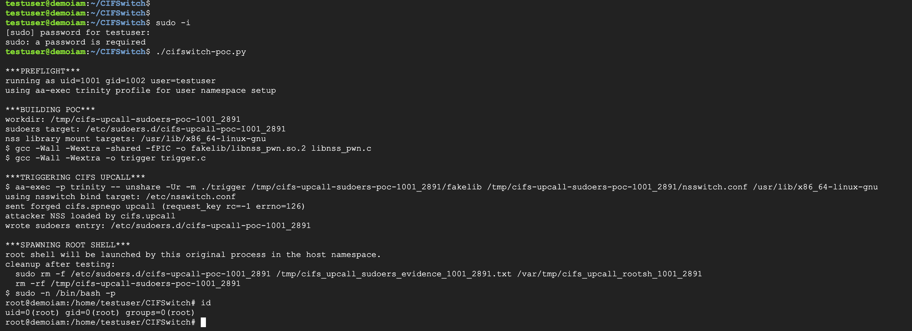

# CIFSwitch

[Writeup](https://heyitsas.im/posts/cifswitch)

> [!WARNING]
> The PoC is provided solely to help defenders, maintainers, and authorized
> security teams validate patches, mitigations, detections, and exposure on
> systems they own or are explicitly authorized to test.
>
> You are solely responsible for ensuring that your use of this material is
> lawful, authorized, controlled, and conducted in an isolated test environment.

## Notes

GCC is required -- the PoC builds two inlined C helpers, a fake NSS library
(to write the `sudoers.d` entry) and a trigger that gets `cifs.upcall` to enter
the PoC's private namespace and load the fake NSS library.

The PoC assumes common `x86_64` NSS module directories -- adjust if necessary.

## How to test

```shell
sudo apt install -y build-essential cifs-utils git
sudo useradd -m -s /bin/bash testuser
sudo su - testuser

git clone https://github.com/chenwei791129/CIFSwitch.git
cd CIFSwitch
chmod +x ./cifswitch-poc.py
./cifswitch-poc.py
```

## DEMO


